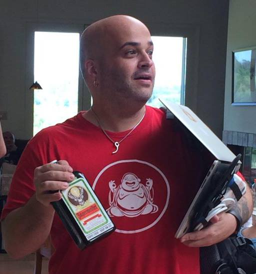
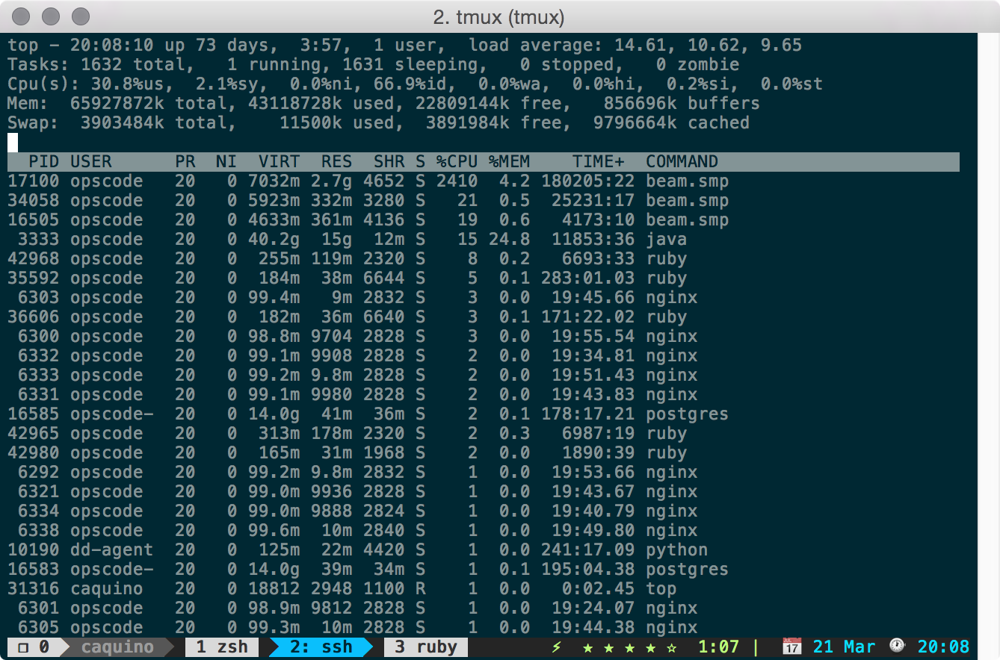
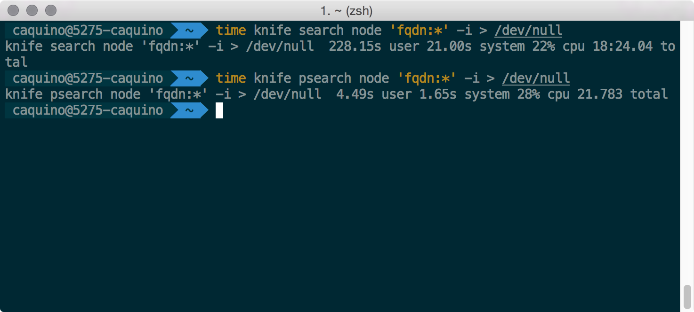
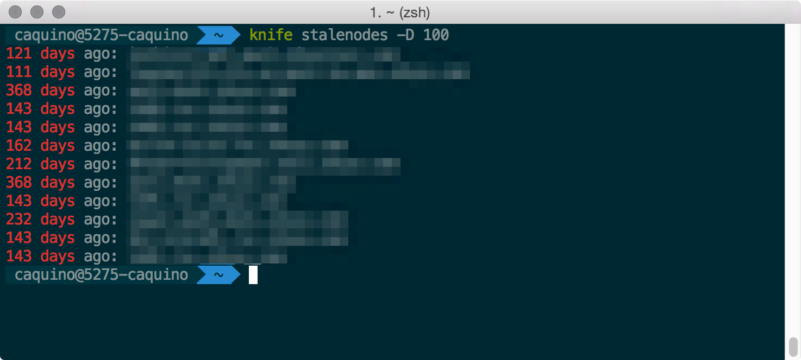
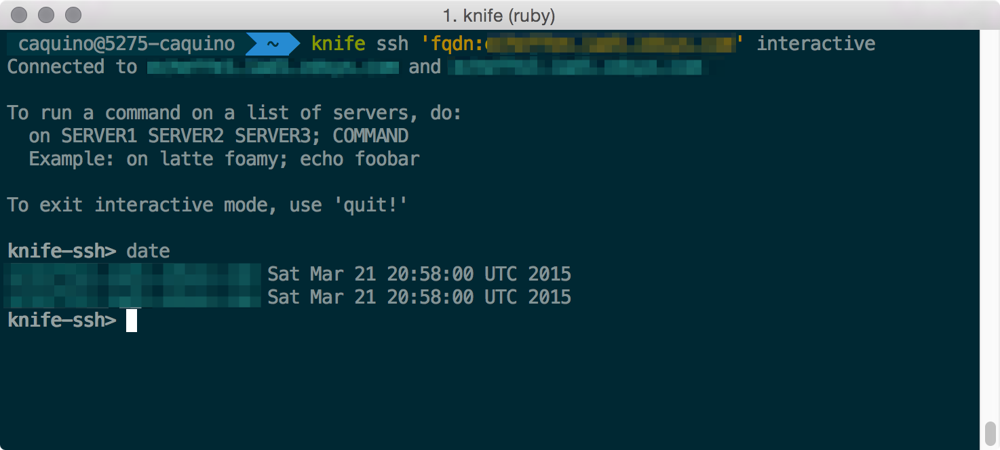
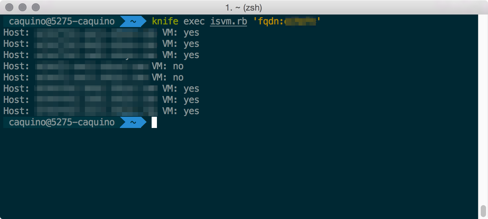

footer: © _Zendesk, 2015_ - Cassiano Aquino - caquino@zendesk.com
slidenumbers: true

#[FIT]CHEF 
#[FIT]_The pains, the growth and the ugly._

----

#[FIT]*The ugly*

---


#The ugly
_Cassiano Aquino_
- Tech Lead DevOps Engineer
- Zendesk
- http://syshero.org/
- http://github.com/caquino
- @syshero
- Linux user since 1995
- Chef user since 2011

_Wrap-up and the presentation will be available in the next few days on my blog._

---

#[FIT]*Chef @ Zendesk*

---
#Chef @ Zendesk 

_Enterprise Chef 12_
- 181 roles
- 200 cookbooks
- ~2000 nodes
- ~93,600 convergences day
- ~28,000,000 attributes

---

#[FIT]*Chef XP*

---
#Beginning
## Party

*Everything works*
- Attributes, a lot of attributes!
- Fast convergences
- Search everywhere

---

#[FIT]*PERFORMANCE*

---
#After party
## Hangover


*Why it's not working anymore?*
- Attribute hoarder
- Run times bigger than interval
- Search? partial search! 
- *DDoS*
- Exterminate! Exterminate!


^ partial search transfer the work of filtering the attribute list to the server


---

#[FIT]DDoS?

---
#Almost!

*avg(node-size) * conv/d * nodes = transferred data*
- avg(node-size): *150KBytes*
- Convergences day: *288* (1 node every 5 minutes)
- Nodes: *2000*

150 * 288 * 2000 = *86,400,000* (~ 82 GBytes) 

_Just a small percentage of the total traffic._
- API calls, Searches, node.save...

---


---
#MONITORING

_Important_
- Clients health :eyes:

*HOW?*
- Report/Exception handlers
- knife status

---
#BUT WHY EVERYTHING IS FAILING NOW?


*Important*
- erchef _:heart:_ CPU

*WHY? WHY?*
- Nodes stored on postgresql
- Compressed JSON attributes
- SOLR is for searches only

^ chef 11
legacy architecture pieces
couchdb data store migrated to postgres
started entirely in ruby and mysql
ditched mysql because of licensing issues


---
#HOW DO I SPEED UP THINGS?


*Old dog, new tricks*
_Attributes_
- Cleanup attributes
- whitelist-node-attrs

_Convergence_
- Adjust convergence interval
- *splay* is your friend! :+1:

_Caching_
- node.run_state

^ node.run_state is a good way of caching data, it's not saved to the chef server

---
# CACHING

_node.run`_`state example_

```ruby
def find_lb_nodes(service_name)
	nodes = node.run_state["lb_nodes_cache"] ||= 
            search(:node, "lb_service:yes")
   nodes.find {|n| n["lb_service_name"] == service_name }
end

web_nodes = find_lb_nodes("http")
db_nodes  = find_lb_nodes("db")
```


---

#[FIT]*ZENDESK*
#[FIT]*ARCHITECTURE*

---
# Stages

_Open Source_
- Scale up 
- Scale out

_Enterprise_
- HA
- HA + Scale out
- HA + DR + Scale out
 
---

#[FIT]HOW?

---

#[FIT]ENTERPRISE
#[FIT]VERSION

---
#TOPOLOGY

_Configurations_
- _HA_
- _tier_
- manual

---
#BACKENDS

```ruby
topology "ha"

server "backend1.domain.com",
  :ipaddress => "192.168.0.22",
  :role => "backend",
  :bootstrap => true,
  :cluster_ipaddress => "194.168.1.22"

server "backend2.domain.com",
  :ipaddress => "192.168.0.23",
  :role => "backend",
  :cluster_ipaddress => "192.168.1.23"

backend_vip "backendvip.domain.com",
  :ipaddress => "192.168.0.24",
  :device => "bond0"
```

---
#FRONTENDS

```ruby
server "frontend1.domain.com",
  :ipaddress => "192.168.0.22",
  :role => "frontend"

server "frontend2.domain.com",
  :ipaddress => "192.168.0.23",
  :role => "frontend"
```

---
#APPLYING THE CONFIGURATION
# Backend and DRBD

_on backend1.domain.com_
- chef-server-ctl reconfigure

_manually configure DRBD on both backends_ 

_on backend1.domain.com_
- chef-server-ctl reconfigure

---
#APPLYING THE CONFIGURATION
# Frontends

_from backend1.domain.com to all servers_
- copy /etc/opscode

_on the remaining servers_
- chef-server-ctl reconfigure


---
# DR SOLUTION
## chef-sync

_Asynchronous distribution_
- cookbooks
- enviroments
- roles
- data bags


---


---
# OPEN SOURCE 

_backend_

```ruby
postgresql['md5_auth_cidr_addresses'] =  [ "127.0.0.1/32",
                                           "::1/128",
                                           "192.168.0.0/24" ]
```

---
# OPEN SOURCE

_frontend disable services_

```ruby
bootstrap["enable"] = false
rabbitmq["enable"] = false
chef_solr["enable"] = false
chef_expander["enable"] = false
bookshelf["enable"] = false
chef_server_webui["enable"] = false
postgresql["enable"] = false
```

---
# OPEN SOURCE

_use backend services_

```ruby
rabbitmq["vip"] = "192.168.0.8"
rabbitmq["node_ip_address"] = "192.168.0.8"
chef_solr["vip"] = "192.168.0.8"
bookshelf["vip"] = "192.168.0.8"
postgresql["vip"] = "192.168.0.8"
lb["upstream"] = {
        "erchef" => [ "127.0.0.1" ],
        "chef-server-webui" => [ "192.168.0.8" ],
        "bookshelf" => [ "192.168.0.8" ]
      }
```

---
# OPEN SOURCE

_small patch_
/opt/chef-server/embedded/cookbooks/chef-server/templates/default/sv-erchef-run.erb

_comment out_

```sh
/opt/chef-server/bin/wait-for-rabbit
```

---


#[FIT]KNIFE

---
# PSEARCH

_gem install knife-psearch_



---
# STALE NODES

_gem install knife-stalenodes_



---
# KNIFE SSH INTERACTIVE


_knife ssh 'fqdn:*.domain.com' interactive_



---
#SEARCH

_All about attributes_
- knife psearch node "(NOT kernel`_`machine:x86_64)"
- knife psearch node "virtualization_role:guest"

_Range_
- knife psearch node "zendesk`_`config_pod:[4 TO 6]"

_Get to know your attributes_
- knife node show -l node.domain.com

---
# Knife EXEC script

```ruby
Chef::Log.level = :fatal
search(:node, ARGV[2]).each do |node|
  vm = (node["virtualization"] &&
        node["virtualization"]["role"] == "guest") ? 'yes' : 'no'
  puts "Host: #{node['fqdn']} VM: #{vm}"
end
exit 0
```

---
# Knife EXEC

_knife exec is`_`vm.rb 'fqdn:*.mydomain.com'_



---

#[FIT]QUESTIONS?
#[FIT]THANKS

---
#[FIT]MADE WITH
#[FIT]DECKSET